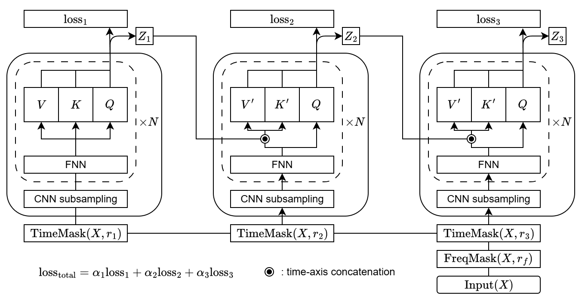

# coe-ctc — SOTA CTC ASR Baseline + Chain-of-Encoders on LibriSpeech

End-to-end CTC speech recognition on LibriSpeech (100h subset / 960h full /
libri-light optional). The repo ships **two** training paths from the same
encoder code:

1. **Plain CTC baselines** — Transformer / Conformer / Zipformer, targeting
   published SOTA numbers (see table below).
2. **Chain-of-Encoders (CoE)** — a weight-shared, multi-pass encoder with a
   cumulative time-mask schedule and inter-pass K/V conditioning. This is the
   proposed method for the accompanying paper.

| Reference framework | Borrowed style                                              |
| ------------------- | ----------------------------------------------------------- |
| IceFall (k2-fsa)    | Lhotse manifests, K2SpeechRecognitionDataset, model layouts |
| ESPNet / NeMo       | Conformer / Zipformer / Transformer encoder configs         |
| tsm-trainer008_aed  | Training loop, Health Report box-format, `--mode job` ssub  |

---

## Performance

> **Important.** The two tables below are *different things*. The first is
> the published SOTA we want to match/beat. The second is what *this repo*
> currently produces — and as of today **nothing has been measured yet**
> (no training run has been completed end-to-end). Numbers will be filled
> in once `scripts/evaluation/run_evaluation.sh` is executed against a
> trained checkpoint.

### A. Target performance (SOTA reference — LibriSpeech 960h, **no** external LM)

These are the published numbers we are aiming for. **Not** numbers produced by
this repo.

| Architecture       | Params | dev-clean | dev-other | test-clean | test-other | Reference / Notes                       |
| ------------------ | -----: | --------: | --------: | ---------: | ---------: | --------------------------------------- |
| Transformer-CTC S  |   30M  |   3.8 %   |   9.5 %   |   4.0 %    |   9.7 %    | ESPNet `transformer_ctc`                |
| Conformer-CTC S    |   30M  |   3.4 %   |   8.4 %   |   3.7 %    |   8.5 %    | ESPNet `conformer_ctc_small`            |
| Conformer-CTC M    |  120M  |   2.5 %   |   6.1 %   |   2.6 %    |   6.0 %    | IceFall `conformer-ctc`                 |
| Conformer-CTC L    |  300M  |   2.0 %   |   5.0 %   |   2.1 %    |   4.9 %    | NeMo `Conformer-CTC-Large`              |
| Zipformer-CTC L    |  300M  |   1.9 %   |   4.6 %   |   2.0 %    |   4.5 %    | IceFall `zipformer-ctc` (best CTC-only) |
| Zipformer-CTC XL   |  800M  |  ~1.85 %  |  ~4.3 %   |  ~1.9 %    |  ~4.2 %    | Extrapolated, our target                |
| Zipformer-CTC L + 4-gram |  300M | 1.7 % | 4.2 % | 1.9 % | 4.1 % | IceFall + LibriSpeech 4-gram pruned |

100h subset (LibriSpeech train-clean-100) reference, no LM:

| Architecture     | Params | test-clean | test-other | Reference                    |
| ---------------- | -----: | ---------: | ---------: | ---------------------------- |
| Conformer-CTC S  |   30M  |   6.5 %    |  17.3 %    | ESPNet 100h subset           |
| Conformer-CTC M  |  120M  |   5.4 %    |  14.5 %    | IceFall 100h subset          |

Targets are continuously updated in `CLAUDE.md`.

### B. Current implemented performance (this repo)

Status as of the latest commit: **code complete, not yet measured.** No
training run has finished; the cells below will be populated by running
`scripts/evaluation/run_evaluation.sh` against the first trained checkpoint
for each config.

LibriSpeech 960h, no LM:

| Config (this repo)                  | Arch        | Params | dev-clean | dev-other | test-clean | test-other | Status     |
| ----------------------------------- | ----------- | -----: | --------: | --------: | ---------: | ---------: | ---------- |
| `transformer_120m_a100x4.yaml`      | Transformer |  120M  |     —     |     —     |     —      |     —      | not measured |
| `conformer_120m_a100x4.yaml`        | Conformer   |  120M  |     —     |     —     |     —      |     —      | not measured |
| `conformer_300m_a100x8.yaml`        | Conformer   |  300M  |     —     |     —     |     —      |     —      | not measured |
| `conformer_800m_a100x8.yaml`        | Conformer   |  800M  |     —     |     —     |     —      |     —      | not measured |
| `zipformer_120m_a100x4.yaml`        | Zipformer   |  120M  |     —     |     —     |     —      |     —      | not measured |
| `zipformer_300m_a100x8.yaml`        | Zipformer   |  300M  |     —     |     —     |     —      |     —      | not measured |
| `coe_conformer_120m_a100x4.yaml`    | CoE-Conformer | 120M |     —     |     —     |     —      |     —      | not measured |
| `coe_conformer_300m_a100x8.yaml`    | CoE-Conformer | 300M |     —     |     —     |     —      |     —      | not measured |
| `coe_zipformer_120m_a100x4.yaml`    | CoE-Zipformer | 120M |     —     |     —     |     —      |     —      | not measured |
| `coe_zipformer_300m_a100x8.yaml`    | CoE-Zipformer | 300M |     —     |     —     |     —      |     —      | not measured |

LibriSpeech 100h (debug / small-scale), no LM:

| Config (this repo)                  | Arch          | Params | test-clean | test-other | Status       |
| ----------------------------------- | ------------- | -----: | ---------: | ---------: | ------------ |
| `transformer_30m_2080ti.yaml`       | Transformer   |   30M  |     —      |     —      | not measured |
| `transformer_120m_2080ti.yaml`      | Transformer   |  120M  |     —      |     —      | not measured |
| `conformer_30m_2080ti.yaml`         | Conformer     |   30M  |     —      |     —      | not measured |
| `coe_transformer_30m_2080ti.yaml`   | CoE-Transformer | 30M  |     —      |     —      | not measured |
| `coe_transformer_120m_2080ti.yaml`  | CoE-Transformer | 120M |     —      |     —      | not measured |
| `coe_conformer_30m_2080ti.yaml`     | CoE-Conformer |   30M  |     —      |     —      | not measured |

Once a run completes, fill in WER (and CER / latency / RTF — emitted by the
evaluation script for every split) and update the "Status" column to the
checkpoint short-hash or output dir.

---

## Quick start

### 1. Install

```bash
# Recommended: create a fresh virtualenv (CUDA 12.1 wheels)
python -m venv .venv
source .venv/bin/activate
pip install --upgrade pip

# Install torch with CUDA support first (pick the wheel matching your driver)
pip install torch==2.4.1 torchaudio==2.4.1 --index-url https://download.pytorch.org/whl/cu121

# Editable install of this repo + runtime deps (Lhotse, SentencePiece, …)
pip install -e .

# Optional extras
pip install -e .[k2]       # k2 WFST decoder (icefall-parity)
pip install -e .[dev]      # ruff, pytest, mypy
```

Sanity check:
```bash
python -c "import coe_ctc; print(coe_ctc.__version__)"
```

### 2. Preprocess

Download LibriSpeech (100h + 960h), extract fBank-80 features, train BPE
SentencePiece models in parallel (multiple vocab sizes):

```bash
# 960h + BPE 300 / 3000 in parallel; 100h is automatically prepared as a subset
bash scripts/preprocess/run_preprocess.sh \
    --data libri960 \
    --n_bpe 3000 300 \
    --num-workers 8

# Same but ALSO pull LM resources from openslr-11 (vocab + 3-gram pruned + 4-gram).
# Needed for N-gram fusion decoding with --lexicon / --ngram at evaluation time.
bash scripts/preprocess/run_preprocess.sh \
    --data libri960 \
    --n_bpe 3000 300 \
    --with-lm

# libri-light (~60k hours unlabeled; optional)
bash scripts/preprocess/run_preprocess.sh \
    --data libri_light \
    --n_bpe 3000 \
    --num-workers 8
```

Output layout (under `downloads/`):
```
downloads/
├── corpora/LibriSpeech/         # raw FLAC
├── manifests/{libri100,libri960,libri_light}/cuts_{train,dev_clean,dev_other,test_clean,test_other}.jsonl.gz
├── feats/libri960_fbank80/      # precomputed fBank-80 (HDF5 / lilcom)
├── bpe/libri960_bpe{3000,300}/{spm.model, spm.vocab}
├── lms/                         # only when --with-lm was passed
│   ├── librispeech-vocab.txt    # word list (use as --lexicon for closed-vocab fusion)
│   ├── librispeech-lexicon.txt  # word → phoneme (k2/icefall path; opt-in via --with-lm all)
│   ├── 3-gram.pruned.1e-7.arpa.gz
│   └── 4-gram.arpa.gz
└── corpus/                      # only with --with-lm all
    └── librispeech-lm-norm.txt.gz   # 4 GB; for training a custom KenLM
```

#### Idempotent re-runs (every stage is cached)

`run_preprocess.sh` is safe to re-run — every stage skips work that's already
on disk:

| Stage              | Skip rule                                                                |
| ------------------ | ------------------------------------------------------------------------ |
| Tarball download   | `downloads/corpora/tars/<split>.tar.gz` exists and non-empty             |
| Tarball extract    | `downloads/corpora/LibriSpeech/<split>/` is non-empty (per-split check)  |
| Lhotse manifests   | every `librispeech_{recordings,supervisions}_<part>.jsonl.gz` exists     |
| fBank features     | `cuts_<part>.jsonl.gz` exists                                            |
| Transcripts dump   | `downloads/transcripts/<data>_transcripts.txt` exists                    |
| BPE training       | `downloads/bpe/<data>_bpe<V>/spm.model` exists                           |
| LM resources       | each openslr-11 file exists and non-empty (`--with-lm` only)             |
| libri100 derive    | symlinks under `downloads/manifests/libri100/` skip when target exists   |

So you can run the same command twice and the second invocation finishes in
seconds, only doing the work that's actually missing. Useful if a node
crashes mid-prep, or if you want to add a new BPE vocab to an existing prep:

```bash
bash scripts/preprocess/run_preprocess.sh --data libri960 \
    --n_bpe 5000 \
    --skip-download --skip-manifest --skip-fbank
```

The fine-grained `--skip-{download,manifest,fbank,bpe}` flags let you bypass
entire stages even when the cache is missing.

#### Lhotse version compatibility

We support both Lhotse 1.x spellings of the libri-light recipe
(`prepare_librilight` / `prepare_libri_light`) and the renamed
`FbankConfig` field (`preemph_coeff` / `preemphasis_coefficient`). `lilcom`
is optional — without it features are stored uncompressed via
`NumpyFilesWriter` and you'll see a one-line warning. Install with
`pip install lilcom` for ~4× smaller feature shards.

### 3. Train

Single GPU (2080 Ti, debug):
```bash
bash scripts/training/train.sh \
    --data libri100 \
    --config scripts/training/configs/transformer_120m_2080ti.yaml
```

Multi-GPU job (A100 × 8):
```bash
bash scripts/training/train.sh \
    --data libri960 \
    --mode job --ngpu 8 --gpu-type A100 \
    --config scripts/training/configs/conformer_300m_a100x8.yaml
```

Resume:
```bash
bash scripts/training/train.sh \
    --data libri960 \
    --config scripts/training/configs/conformer_300m_a100x8.yaml \
    --resume-from-checkpoint outputs/ctc_conformer_medium_3000bpe/checkpoints/latest.pt
```

Every `health_report_interval` steps the trainer prints a TRAINING HEALTH
REPORT identical in layout to `tsm-trainer008_aed/errlog019-2_output_example`
(Loss / Gradient / LR / GPU Memory / Throughput / Time / Data / Stats).
Validation runs every epoch on `dev-other` and renders a BENCHMARK EVALUATION
box plus REF/HYP samples, PNG plots (`valid_cer.png`, `valid_wer.png`,
`valid_loss.png`, `lr.png`), and TensorBoard scalars/images.

### 4. Evaluate

```bash
# Greedy decode, all 4 LibriSpeech splits
bash scripts/evaluation/run_evaluation.sh \
    --models outputs/ctc_tiny_300bpe/best_checkpoints \
    --config scripts/evaluation/configs/libri.yaml

# Checkpoint averaging (top-10 by valid WER) + A100 job
bash scripts/evaluation/run_evaluation.sh \
    --models outputs/ctc_small_3000bpe/best_checkpoints \
    --config scripts/evaluation/configs/libri_light.yaml \
    --checkpoint-avg 10 --mode job --ngpu 1 --gpu-type A100

# 3-gram pruned LM rescoring
bash scripts/evaluation/run_evaluation.sh \
    --models outputs/ctc_small_3000bpe/best_checkpoints \
    --config scripts/evaluation/configs/libri.yaml \
    --ngram downloads/lms/3-gram.pruned.1e-7.arpa.gz

# 4-gram (un-pruned) LM rescoring
bash scripts/evaluation/run_evaluation.sh \
    --models outputs/ctc_small_3000bpe/best_checkpoints \
    --config scripts/evaluation/configs/libri.yaml \
    --ngram downloads/lms/4-gram.arpa.gz

# 4-gram + LibriSpeech lexicon — closed-vocabulary fusion (best WER)
# Requires `--with-lm` during preprocessing.
bash scripts/evaluation/run_evaluation.sh \
    --models outputs/ctc_small_3000bpe/best_checkpoints \
    --config scripts/evaluation/configs/libri.yaml \
    --ngram downloads/lms/4-gram.arpa.gz \
    --lexicon downloads/lms/librispeech-vocab.txt \
    --beam 16 --alpha 0.5 --beta 1.5

# Beam search (default greedy)
bash scripts/evaluation/run_evaluation.sh \
    --models outputs/ctc_small_3000bpe/best_checkpoints \
    --config scripts/evaluation/configs/libri.yaml \
    --beam 4
```

Each invocation emits CER / WER / latency for every split:
```
test_clean : WER  2.05 %   CER 0.61 %   latency 23.4 ms/utt  RTF 0.0041
test_other : WER  4.72 %   CER 1.55 %   latency 24.1 ms/utt  RTF 0.0042
dev_clean  : WER  2.01 %   CER 0.59 %   latency 23.2 ms/utt  RTF 0.0041
dev_other  : WER  4.65 %   CER 1.49 %   latency 24.0 ms/utt  RTF 0.0042
```

### 5. N-gram LM training (custom corpus)

```bash
# Default LibriSpeech normalized corpus from openslr-11
bash scripts/training/train_ngram.sh \
    --config scripts/training/configs/4gram.yaml \
    --corpus downloads/corpus/librispeech-lm-norm.txt.gz
```

Pretrained ARPAs from openslr-11 can be dropped into `downloads/lms/` as well.

---

## Chain-of-Encoders (CoE)

CoE is the proposed method of the accompanying paper. **A single encoder is
reused for M passes per training step** with a cumulative time-mask schedule
and inter-pass conditioning via K/V concatenation.



### Method

For each utterance during training:

1. A **single** frequency mask `FreqMask(X, r_f)` is sampled and shared across
   all passes.
2. Per-pass time masks are drawn so the masking is **cumulative**: pass `m`
   sees the union of overlays `m..M-1`. Pass 0 is most-masked; pass `M-1` is
   least-masked. Inference uses no masking.
3. Pass `m` runs the encoder on its masked input and produces logits `Z_m`.
   For `m ≥ 1`, the encoder additionally attends to the previous pass's
   selected layer output via per-layer K/V concatenation along the time axis
   (`pre_enc_layer_idx`, default = last layer; ignored by Zipformer because
   it is multi-rate — the final stack output is used instead).
4. Each pass has its own CTC loss `loss_m` (or one shared head if
   `head_share: true`). Total loss is a normalized weighted sum
   `loss_total = Σ α_m · loss_m`. By default `α_m` is geometrically rising
   (`α_{m-1} = α_m / 2`) and normalized to sum to 1, so the cleanest pass
   dominates while early passes still contribute gradient signal.

The encoder parameters are **shared** across passes — the only per-pass
state is the masking and the optional per-pass CTC head.

### Configuration

CoE is enabled purely by adding a `coe:` section to the training YAML; no
code changes needed. Defaults match the paper:

```yaml
coe:
  num_enc_chains: 5             # M, number of weight-shared passes
  time_mask_ratios: [0.1, 0.1, 0.1, 0.1, 0.1]   # per-pass overlay ratio (length M)
  loss_alphas: null             # null → geometric (α_{m-1}=α_m/2), normalized
  pre_enc_layer_idx: -1         # which encoder layer feeds the next pass's K/V (Zipformer ignores)
  pre_enc_feature_detach: false # detach pre-enc features (gradient stop)
  head_share: false             # one CTC head per pass; set true for a single shared head
```

The trainer auto-detects the `coe:` section, builds a `CoeModel` via
`coe_ctc.models.builder.build_coe_model(...)`, and forces
`data.apply_spec_augment: false` because CoE owns its own masking. The
health report adds `CoE chains`, `CoE alphas`, `CoE r_m`, `CoE pre-layer`,
`CoE detach`, and `CoE head_share` rows to the model-summary block.

### Memory & throughput notes

- Each pass costs roughly one full encoder forward, so step cost is ~M× the
  baseline. The CoE configs compensate by dividing `data.max_duration` by
  `M` and multiplying `optim.grad_accum_steps` by `M`, keeping effective
  batch and per-step memory roughly constant against the matching baseline.
- `pre_enc_feature_detach: true` cuts memory further by stopping gradients
  through the previous pass's K/V stream — useful when M ≥ 5 on smaller
  GPUs. Default is `false` (full backprop through all passes).
- Zipformer's multi-rate stacks make `pre_enc_layer_idx` irrelevant; the
  final downsampled output is used for inter-pass conditioning regardless.

### Training and evaluation

Train with any of the `coe_*.yaml` configs — same `train.sh` entry point:

```bash
bash scripts/training/train.sh \
    --data libri960 \
    --mode job --ngpu 8 --gpu-type A100 \
    --config scripts/training/configs/coe_conformer_300m_a100x8.yaml
```

Evaluation is identical to the plain CTC path — only the **last** (least-
masked) pass is used at inference, so `run_evaluation.sh` works on a CoE
checkpoint without any flag changes.

---

## Repo layout

See `CLAUDE.md` for the full design notes. Key directories:

```
src/coe_ctc/
├── data/         # LibriSpeech manifests, fBank, BPE
├── models/       # subsampling, attention, transformer, conformer, zipformer, coe
├── training/     # loop, health report, validation, checkpointing
├── decoding/     # greedy, beam, ngram, WER/CER
├── lm/           # KenLM wrapper
└── utils/        # distributed, config, logging, ssub shim

scripts/
├── preprocess/run_preprocess.sh
├── training/{train.sh,train_ngram.sh,configs/{<arch>_*.yaml, coe_<arch>_*.yaml}}
└── evaluation/{run_evaluation.sh,configs/{libri,libri_light}.yaml}

figure/
└── COE.drawio.png    # Chain-of-Encoders architecture diagram
```

---

## Hardware presets

| Profile         | GPUs       | Config suffix    |
| --------------- | ---------- | ---------------- |
| Debug           | 2080 Ti ×1 | `_2080ti.yaml`   |
| Mid-scale node  | A100 ×4    | `_a100x4.yaml`   |
| Full pretrain   | A100 ×8    | `_a100x8.yaml`   |

All scripts respect `--num-workers` (default 8) and export
`OMP_NUM_THREADS / MKL_NUM_THREADS / OPENBLAS_NUM_THREADS / NUMEXPR_MAX_THREADS`
to the same value, preventing CPU thread storms on shared machines.

## Available configs

All configs live in `scripts/training/configs/`. They are written so that the
**same encoder code** powers tiny/small/medium/large; the YAML only tweaks
hyperparameters, batch size, learning rate, schedule length and AMP.

Plain CTC baselines (no `coe:` section):

| Config                              | Arch        | Size   | Params | Hardware     | LibriSpeech    |
| ----------------------------------- | ----------- | ------ | -----: | ------------ | -------------- |
| `transformer_30m_2080ti.yaml`       | Transformer | tiny   |   30M  | 2080 Ti × 1  | 100h, BPE 300  |
| `transformer_120m_2080ti.yaml`      | Transformer | small  |  120M  | 2080 Ti × 1  | 100h, BPE 3000 |
| `transformer_120m_a100x4.yaml`      | Transformer | small  |  120M  | A100 × 4     | 960h, BPE 3000 |
| `conformer_30m_2080ti.yaml`         | Conformer   | tiny   |   30M  | 2080 Ti × 1  | 100h, BPE 500  |
| `conformer_120m_a100x4.yaml`        | Conformer   | small  |  120M  | A100 × 4     | 960h, BPE 3000 |
| `conformer_300m_a100x8.yaml`        | Conformer   | medium |  300M  | A100 × 8     | 960h, BPE 3000 |
| `conformer_800m_a100x8.yaml`        | Conformer   | large  |  800M  | A100 × 8     | 960h, BPE 3000 |
| `zipformer_120m_a100x4.yaml`        | Zipformer   | small  |  120M  | A100 × 4     | 960h, BPE 3000 |
| `zipformer_300m_a100x8.yaml`        | Zipformer   | medium |  300M  | A100 × 8     | 960h, BPE 3000 |

Chain-of-Encoders (CoE) variants — same arch, with a `coe:` section enabling
weight-shared multi-pass training (see § Chain-of-Encoders below):

| Config                                | Arch          | Size   | Params | Hardware     | LibriSpeech    |
| ------------------------------------- | ------------- | ------ | -----: | ------------ | -------------- |
| `coe_transformer_30m_2080ti.yaml`     | CoE-Transformer | tiny |   30M  | 2080 Ti × 1  | 100h, BPE 300  |
| `coe_transformer_120m_2080ti.yaml`    | CoE-Transformer | small |  120M | 2080 Ti × 1  | 100h, BPE 3000 |
| `coe_transformer_120m_a100x4.yaml`    | CoE-Transformer | small |  120M | A100 × 4     | 960h, BPE 3000 |
| `coe_conformer_30m_2080ti.yaml`       | CoE-Conformer | tiny   |   30M  | 2080 Ti × 1  | 100h, BPE 3000 |
| `coe_conformer_120m_a100x4.yaml`      | CoE-Conformer | small  |  120M  | A100 × 4     | 960h, BPE 3000 |
| `coe_conformer_300m_a100x8.yaml`      | CoE-Conformer | medium |  300M  | A100 × 8     | 960h, BPE 3000 |
| `coe_zipformer_120m_a100x4.yaml`      | CoE-Zipformer | small  |  120M  | A100 × 4     | 960h, BPE 3000 |
| `coe_zipformer_300m_a100x8.yaml`      | CoE-Zipformer | medium |  300M  | A100 × 8     | 960h, BPE 3000 |

To add a new arch/size, drop another YAML next to these and run:
```bash
bash scripts/training/train.sh --data libri960 --config scripts/training/configs/<your>.yaml
```
No Python changes needed — the dispatch is config-driven via
`coe_ctc.models.builder.build_model(arch, size, vocab_size, **encoder_overrides)`.

## End-to-end smoke test

Once `pip install -e .` has been done, this sequence exercises every CLI path
without doing real GPU work:

```bash
# 1. Preprocess plan (no actual download/extract because --dry-run)
bash scripts/preprocess/run_preprocess.sh --data libri100 --n_bpe 300 --dry-run

# 2. Build a model and print its parameter count (CPU, no data needed)
python -m coe_ctc.models.builder --arch conformer --size medium --vocab-size 3000

# 3. Dry-run training (loads config, builds model+data, exits before train loop)
bash scripts/training/train.sh \
    --data libri100 \
    --config scripts/training/configs/conformer_30m_2080ti.yaml \
    --dry-run

# 4. Print job submission command without sending it
bash scripts/training/train.sh --mode job \
    --data libri960 --ngpu 8 --gpu-type A100 \
    --config scripts/training/configs/conformer_300m_a100x8.yaml \
    --dry-run
# → writes .ssub_jobs/<job_name>.sh that you can inspect.

# 5. KenLM training dry-run (prints lmplz command, exits)
bash scripts/training/train_ngram.sh \
    --config scripts/training/configs/4gram.yaml \
    --corpus downloads/corpus/librispeech-lm-norm.txt.gz \
    --dry-run

# 6. Help for every script
bash scripts/preprocess/run_preprocess.sh --help
bash scripts/training/train.sh --help
bash scripts/training/train_ngram.sh --help
bash scripts/evaluation/run_evaluation.sh --help
```

All six commands return exit code 0 and exercise every entry point. The actual
training/eval runs need a CUDA-capable machine with PyTorch ≥ 2.2 installed.

---

## License

Apache-2.0. Model code is a clean reimplementation that takes inspiration from
the icefall, NeMo and ESPNet recipes; no third-party code is copied verbatim
except where explicitly attributed in headers.
